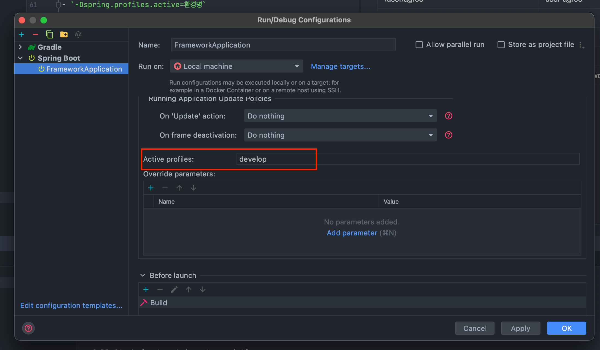

> # JH - Spring Boot + Graph QL 기반의 API  프로젝트


## 들어가기
- 개인프로젝트를 위한 스프링 + 그래큐QL + MySql 기반 프레임워크
- Spring for GraphQL 1.0.0 프로토타입

## 사용 버전

| 이름                               | 버전          | 사용                         |
| ---------------------------------- | ------------- | ---------------------------- |
| spring boot                        | 2.7.1         |                              |
| jpa                                | 3.0.1         |                              |
| swagger                            | 4.0.0         | API 개발 및 API 문서            |
| query dsl                          | 5.0.0         |                          |
| spring-boot-starter-graphql        | 1.0.0         | 스프링에서 공식제공 GraphQl       


## 프로젝트 초기 설정

- `TODO`, `FIXME` 확인 하고 수정한다
- `.application.yml` 파일 확인하고 수정한다
- `DB URL`  :
- `AWS KEY` :  

  


## 기본 url 정의


| 패턴                                       | name                 | 기능 명         |
| ------------------------------------------ | -------------------- | --------------- |
| /                                          | home-main            | 메인 화면       
| /user/login                                | user-login           | 로그인화면      |
| /user/agree                                | user-agree           | 약관동의        |
| /user/register                             | user-register        | 회원가입        |
| /user/find/id                              | user-find-id         | 아이디 찾기     | 
| /user/find/pwd                             | user-find-pwd        | 비밀번호 찾기   |  
| /user/modify/pwd/:userId/:expireDate/:hash | user-modify-pwd      | 비밀번호 변경   | 


## 주의

### tdd 규칙


## 실행 

`VM Option`세팅

-
- develop: 개발 / test: 테스트 / product: 운영

### 개발환경 DB 세팅

- schema.sql 테이블 세팅
- data.sql 임시 데이터 세팅
- `defer-datasource-initialization: true` 스프링 2.5.0 이후로 data.sql을 schema.sql 이후에 실행 시키기 위한 설정
```
  sql:
    init:
      schema-locations: classpath:sql/schema.sql
      data-locations: classpath:sql/data.sql
      mode: always
```

## 배포하기


## 그래프큐엘 스키마 폴더 정책

- `resources/graphql/`도메인명
  - 도메인명의 기준은  `kr.co.jh.frameowork`도메인명 <- 위 폴더 구조와 동일하다.
- `resources/graphql/도메인명` 안에 .graphqls 구조
  - `도메인명.graphqls` 안에 도메인 type, query, mutation 도메인과 메소드가 들어감 
  - `도메인명Input.graphqls` 안에 post, put에 대한 RequestBody 값이 들어감  

  
